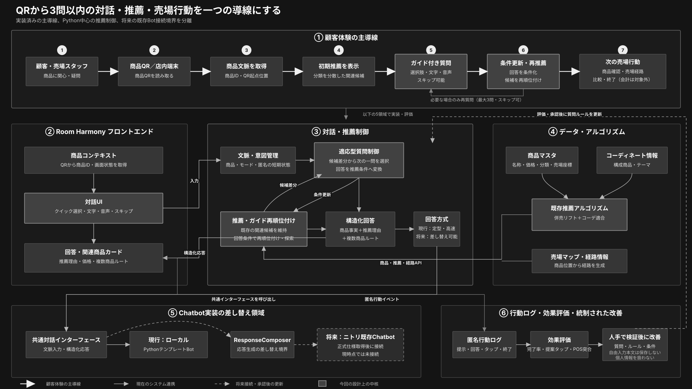

# Room Harmony

来店客向けWebアプリ（レスポンシブ／PWA）。店内の商品QRを起点に、**関連商品提示・3問以内のガイド型チャット・コーディネート提案・複数商品の店内ルート案内**を一つの導線にし、同じ空間に置く商品の認知と併売を促す。
要件は `docs/DESIGN.md`（全体設計）・`docs/DECISIONS.md`（確定事項）・`docs/CHATBOT_REQUIREMENTS.md`（チャット要件）・`docs/CHATBOT_AUDIT.md`（課題適合性の批評・修正記録）を参照。

> ステータス: **ガイド型チャット統合版**。既存の推薦・QR・コーディネート・ルート機能を維持したまま、Python中心の質問制御、説明可能な後段再ランキング、キーボード／音声入力、スタッフ向け根拠表示、匿名KPIを追加した。

## 非開発者向けデスクトップ配布版

GitHubの緑色の「Code → Download ZIP」は**開発用ソースコード**であり、PythonとNode.jsを含まない。非開発者へ渡す場合は、GitHub ReleasesまたはActionsの `Desktop release` からOSに合う次の自己完結ZIPを使う。

- `RoomHarmony-Windows-x64.zip`: 解凍後 `RoomHarmony.exe` を起動
- `RoomHarmony-macOS-arm64.zip`: Apple Silicon（M1以降）向け `Room Harmony.app`
- `RoomHarmony-macOS-x64.zip`: Intel Mac向け `Room Harmony.app`

署名資格情報を使わない内部検証ビルドはファイル名に `-unsigned` が付き、公開Release工程はそれを正式配布物として公開することを拒否する。

これらの配布版はPython・Node.js・npmの事前インストールを要求しない。起動時に同梱データを厳格検査し、空いているloopbackポートでFastAPIと構築済みReact画面を一つのプロセスから配信し、実際の `/health` と画面応答を確認してからブラウザを開く。実行時DB・ログ・診断情報は、プログラム本体ではなく次へ保存する。

- Windows: `%LOCALAPPDATA%\RoomHarmony`
- macOS: `~/Library/Application Support/RoomHarmony`

起動後の小さな管理画面からデモを再度開く、診断情報を確認する、安全に終了する、の三操作ができる。8000番ポートが他のアプリに使われていても、他プロセスを停止せず空きポートへ切り替える。

> 署名上の注意: 自己完結化とOSの配布元信頼は別問題である。未署名の試作成果物ではWindows SmartScreenまたはmacOS Gatekeeperの警告が出る。一般配布を「警告なしのダブルクリック」にするには、Windowsコード署名証明書、およびApple Developer ID署名・notarizationをリリース工程へ設定する必要がある。資格情報を持たないローカル/CIビルドを正式配布物と誤認しないこと。詳細は [`packaging/README.md`](packaging/README.md)。

---

## 1. 完成版の全体フロー



白い太線は来店客の主導線、細い実線は現在実装済みのシステム連携、破線は将来のニトリ既存Chatbot接続または人手承認後の更新を示す。図はSVGのため、GitHub上でも拡大して確認できる。発表資料や印刷には、同じ内容を保持した[ベクターPDF版](docs/assets/room-harmony-chatbot-flow.pdf)を利用できる。

主導線は次の通りである。

1. 来店客またはスタッフが、商品QR（カメラ非対応時は商品番号）から来店セッションを開始する。
2. QRの商品IDとQR起点位置を引き継ぎ、既存推薦器が関連候補を生成する。
3. 同一カテゴリだけで画面が埋まらないよう、初期候補を複数カテゴリへ分散して表示する。
4. 顧客は自由作文を強制されず、最大3問の選択肢に回答する。文字入力・対応ブラウザの音声入力・スキップも使える。
5. 回答は価格・分類・既知の色・売場・コーディネート適合度等の構造化条件へ変換され、既存候補の後段再ランキングに使われる。
6. 商品カードの理由を確認し、1商品または複数商品の売場ルートへ進む。会計システムとの接続は本実装の対象外である。

## 2. Chatbotの設計意図

### 2.1 生成AIではなく「ガイド型推薦インターフェース」

初版はOpenAI等の外部LLMへ接続せず、Pythonの質問ポリシー・再ランキング・日本語テンプレートで動作する。そのため `sk-...` のAPIキーは不要で、商品情報を外部サービスへ送らない。9,180件の商品データでのローカル計測では、初期構築後の1ターンは概ね数十msで処理できる。

Chatbotは新しい商品を勝手に生成しない。既存 `PersonalizedRecommender` が併売リフトとコーディネート適合度から候補を作り、`GuidedReranker` が来店客の回答を使って候補集合の中を並べ替える。この責務分離により、従来の `/api/recommendations` の結果と既存画面を壊さない。

### 2.2 「相性」と「探索」の違い

- **まとまり・相性**: 既存スコアと登録済みコーディネートで一緒に使われる商品を重視する。
- **価格を抑える**: 関連候補内の相対価格を使い、価格を抑えやすい商品を上げる。
- **新しい組み合わせ**: 関連候補という安全な範囲を維持しながら、高リフト・低併売率の分類と、異なる商品種類・価格帯・既知の色・売場を持つ候補を広く提示する。
- **関連性を優先**: 既存の併売リフトと関連度を主信号として維持する。

「探索」は売上向上を保証する機能ではない。商品単位の実併売データが無い現状でAIが未知の相性を発見したとは主張せず、比較対象を広げる仮説生成として扱う。効果判定にはA/B割付とPOS突合が必要である。treatmentは「既存Room Harmony＋ガイド型チャット」、controlは「既存Room Harmonyフロー」であり、システム全体の利用／非利用比較ではない。

### 2.3 質問を固定しない理由

`products.json` は価格・分類・売場座標を全件で持つ一方、色が取得できた商品は全体の一部だけである。したがって色の質問は、現在の関連候補で60%以上の色が分かり、かつ2色以上を比較できる場合だけ表示する。回答が実際に順位を変えられない質問を出さないことで、「聞いただけの見せかけの個人最適化」を避ける。

### 2.4 ニトリ既存Chatbotとの将来接続

現行の応答生成は `ResponseComposer` 境界の `TemplateResponseComposer` である。正式な接続仕様・認証方式・データ取り扱い条件が提供された後は、この応答生成部分を既存Bot向けアダプタへ差し替えられる。公開する `/api/chat/turn`、質問状態、推薦器、フロント画面は維持する設計である。従来の外部ディープリンク `ChatbotLink` もcontrol群・既存連携用に残しているが、実在する `VITE_CHATBOT_BASE_URL` が無い状態では「接続準備中」と表示し、ダミーURLへは遷移させない。

## 3. データの出所と限界

| データ | 現在の内容 | 出所・生成方法 | 本番前に必要な差し替え |
|---|---|---|---|
| 商品マスタ | 9,180商品。名称・価格・画像・商品URL・分類等 | [ニトリネット公式EC](https://www.nitori-net.jp/ec/)の商品ページ情報を手動取得済みCSVから変換。例: [商品7017971s](https://www.nitori-net.jp/ec/product/7017971s/)。自動スクレイピングは実装していない | 承認済みの商品・価格・在庫フィード |
| 併売リフト | 中分類9種・12ペア | 実習用の仮設定から `backend/batch/lift_batch.py` で再現可能に算出。**ニトリの実POSではない** | 実トランザクションまたは承認済み集計値 |
| コーディネート | 暫定6セット | 実商品IDから `backend/ingest/build_coordinates.py` が決定的に生成。スタイリスト入稿ではない | 正式な構成商品・テーマ・完成画像 |
| 売場位置・マップ | 4フロア、カテゴリ代表座標 | 目黒通り店を参考にした検証用モデル。同一中分類の商品は代表点を共有 | 実測フロア・什器・商品位置 |
| POS指標 | 併売率・買上点数・客単価のサンプルスロット | 検証用の仮値 | 実験群と突合可能な実POS集計 |
| システムキッチン資料 | 商品マスタには未使用 | [法人・リフォーム事業の配布資料ページ](https://www.nitori.co.jp/reform/reformmenu/system_kitchen/)は課題背景の関連資料であり、現在の9カテゴリの商品入力元ではない | 対象カテゴリへ広げる場合に別途データ設計 |

各商品には取得元 `source_url` を保持している。一方、併売率・座標・コーディネートまでニトリ公式サイトから得たものではない。この区別を崩すと、デモデータを「実績」と誤認するため注意する。詳細は `data/README.md` を参照。

## 4. 開発用ソースコードの前提環境

- OS: Windows（既存 `start-demo.cmd`）またはmacOS（手動開発起動）
- Python: 3.11以上（3.13推奨）。ワンクリック起動器は利用可能な `py` または `python` を自動選択する。確認: `py --version` または `python --version`
- Node.js: v22系推奨（ワンクリック起動はNode.js 24 / npm 11でも検証済み）。確認: `node -v` / `npm -v`
- git: 2.x

ここに挙げた環境はソースコードから開発・テストする人向けであり、上記のデスクトップ配布版利用者には不要である。

---

## 5. リポジトリ構成

```
room-harmony/
├─ frontend/         # TypeScript + React（Vite, PWA）。QR読取・SVG地図/ルート・5画面・計測
│  ├─ src/api/       # OpenAPIからの型・fetchクライアント
│  ├─ src/pages/     # S1 Scan / S2 Product / S3 Coordinate / S4 Route
│  ├─ src/components/# FloorMap / ChatbotPanel / ChatbotLink 等
│  ├─ src/hooks/     # useEventLog（計測）
│  └─ e2e/           # Playwright E2E（G4）
├─ backend/          # Python + FastAPI
│  ├─ app/           # API層（main.py, routers/, dependencies.py, store.py, experiment.py, errors.py）
│  │  └─ chat/       # 質問ポリシー・会話サービス・応答生成の差し替え境界
│  ├─ recommender/   # 中分類併売率→リフト近似＋ハイブリッド（RecommenderInterface / HybridRecommender）
│  │  └─ guided.py   # 回答条件を使う説明可能な後段再ランキング
│  ├─ routing/       # ウェイポイント・グラフ最短経路（networkx, 4フロア・階段/EV接続）
│  ├─ dataio/        # data/*.json ローダ（欠損時フォールバック）
│  ├─ scripts/       # export_openapi.py（docs/openapi.json 出力）
│  └─ tests/         # unit（G1）/ integration（G2）
├─ data/             # サンプルデータ（products/co_purchase/coordinates/store_map/qr_codes/aggregates ほか）
├─ docs/             # DESIGN / CHATBOT_REQUIREMENTS / CHATBOT_AUDIT / 完成版SVG・PDF / openapi.json
├─ harness/          # QAゲートのレポート・証跡
├─ demo-launcher/    # Windowsワンクリック起動／停止の内部PowerShellスクリプト
├─ packaging/        # PyInstaller仕様・Windows/macOS配布版ビルド・漏洩監査
├─ .github/workflows/# 3 OS/CPU向けビルド・テスト・タグRelease公開
├─ start-demo.cmd    # ダブルクリックで依存確認→前後端起動→商品QRデモを開く
├─ stop-demo.cmd     # 起動器が開始した前後端サービスを安全に停止
├─ .env.example
└─ README.md
```

---

## 6. 環境変数（`.env.example`）

ルートの `.env.example` はバックエンド環境変数の参照一覧である。`python-dotenv` を必須依存にしないため、バックエンドは**ルートの `.env` を自動では読み込まない**。未設定なら開発用の既定値で動作し、上書きする場合は起動するPowerShellまたはデプロイ先のプロセスマネージャーで設定する。Viteは `frontend/` 直下の `.env*` だけを読むため、フロント変数は `frontend/.env.example` を `frontend/.env` へコピーする。秘匿値はコミットしないこと。

| 変数 | 用途 |
|---|---|
| `DATABASE_URL` | セッション/イベントログの保存先。開発は SQLite（既定 `sqlite:///./data/room_harmony.db`）。本番は PostgreSQL 等に差し替え |
| `CHATBOT_BASE_URL` | バックエンド側に残す将来接続用の予約設定。現在の外部リンクUIはこの値を直接参照しない |
| `STORE_ID` | 対象店舗ID（サンプルは目黒通り店ベースの4フロア、既定 `meguro-dori`） |
| `EXPERIMENT_GROUP_MODE` / `EXPERIMENT_GROUP_RATIO` | 実験群（A/B）割付の方式・比率（既定 random / 0.5） |
| `CORS_ALLOW_ORIGINS` | バックエンドCORS許可オリジン（カンマ区切り。既定に dev 5173 / preview 4173 を含む） |
| `VITE_API_BASE_URL` | フロントから参照するバックエンドAPIのベースURL（既定 `http://localhost:8000`） |
| `VITE_CHATBOT_BASE_URL` | 外部ChatbotLinkの遷移先。未設定・不正・`example.invalid` では非リンク表示。統合ガイド型チャットのAPI接続には使わない |

```powershell
# バックエンドの上書き例（現在のPowerShellセッションにだけ適用）
$env:EXPERIMENT_GROUP_RATIO = "1.0"
$env:ADMIN_API_TOKEN = "change-this-token"

# フロントのAPIアドレス／外部Botリンクを変更する場合
Copy-Item frontend\.env.example frontend\.env
```

---

## 7. セットアップ・起動

### 7.1 Windowsワンクリック起動（デモ推奨）

GitHubのWeb画面上では実行できないため、リポジトリをWindows PCへダウンロードまたはcloneした後、ルート直下の次のファイルをダブルクリックする。

```text
start-demo.cmd
```

起動器は以下を順番に自動実行する。

1. Python・Node.js・npmとプロジェクト構成を確認する
2. 初回のみ `backend/.venv` を作成し、Python依存関係をインストールする
3. 初回のみロックファイルに従って `frontend/node_modules` を作成する（npm 11の既知peer依存判定にも対応）
4. デモ用に `EXPERIMENT_GROUP_RATIO=1.0` をバックエンド子プロセスへ設定する
5. FastAPI（8000）とReact/Vite（5173）をバックグラウンドで起動する
6. 両方の応答を確認後、Chromeのアプリウィンドウまたは既定ブラウザで次の画面を開く

```text
http://localhost:5173/s/QR-PRODUCT-01-02-01-0799
```

初回だけ依存関係の取得にインターネット接続と数分を要する場合がある。2回目以降はインストール済み環境を再利用するため、通常は起動待ちだけでよい。起動器が設定するtreatment比率は子プロセス限定であり、PCの永続的な環境変数や `.env` は変更しない。

初回セットアップが通信切断等で中断された場合も、再度 `start-demo.cmd` を実行すれば不足しているPython／Node.js依存関係を検出して修復する。

終了時はルート直下の次のファイルをダブルクリックする。

```text
stop-demo.cmd
```

実行中のPID・起動時刻・ログはGit管理対象外の `.room-harmony-demo/` に保存される。停止時はこれらを照合し、この起動器が開始したRoom Harmonyプロセスだけを停止する。8000または5173を別のアプリが使用中の場合は、誤停止せずエラーを表示する。詳細は [`demo-launcher/README.md`](demo-launcher/README.md)。

### 7.2 バックエンドを手動起動する（Python + FastAPI）

```powershell
cd backend
py -m venv .venv
.venv\Scripts\python -m pip install --upgrade pip
.venv\Scripts\python -m pip install -r requirements.txt

# 開発サーバ起動（http://localhost:8000）
.venv\Scripts\python -m uvicorn app.main:app --reload
```

動作確認: `http://localhost:8000/health` が `{"status":"ok"}` を返す。API仕様は起動後 `http://localhost:8000/docs`（Swagger UI）、または `docs/openapi.json`。

サンプルデータは `data/*.json` をそのまま参照する（別途の投入作業は不要）。OpenAPIスキーマを再生成する場合:

```powershell
cd backend
.venv\Scripts\python scripts\export_openapi.py   # docs/openapi.json を出力
```

**リフト算出バッチ（フェーズ2-A）**：`data/co_purchase.json` は手書きではなく、
`data/co_purchase_source.json`（中分類の単体支持度・共起支持度という「素の集計」。実データ差し替え口）
から以下のコマンドで再現可能に生成する（詳細・算出式は `data/README.md`）:

```powershell
cd backend
.venv\Scripts\python -m batch.lift_batch
```

### 7.3 フロントエンドを手動起動する（TypeScript + React / Vite）

```powershell
cd frontend
npm ci --legacy-peer-deps
npm run gen:api      # docs/openapi.json から src/api/schema.ts を生成
npm run dev          # http://localhost:5173
```

本番ビルド／プレビュー:

```powershell
npm run build
npm run preview      # http://localhost:4173
```

---

## 8. 一連の体験を再現する（カメラ不要のURL直リンク）

実カメラが無くても、QRに紐づくURL直リンクで同一フローに到達できる（要件4.1のフォールバック）。
backend（8000）と frontend（dev 5173 もしくは preview 4173）を起動した状態で、ブラウザで次を開く:

```
http://localhost:5173/s/QR-PRODUCT-01-02-01-0799
```

デモで統合ガイド型チャットを必ず表示する場合は、バックエンド起動前にPowerShellで利用群を100%にする（本番評価時は0.5等へ戻す）。

```powershell
$env:EXPERIMENT_GROUP_RATIO = "1.0"
```

1. **S1 スキャン**: 商品番号付きQRを解決してセッション開始（`experiment_group` 割付、`session_start`/`qr_scan` 記録）
2. **S2 商品詳細**: 商品情報＋関連商品＋コーディネート＋「3問以内でコーディネート相談」を表示
3. **ガイド型チャット**: 選択肢・文字・音声・スキップで条件を反映。お客様向け／スタッフ向けを開始前に選択できる
4. **複数商品の売場ルート**: 「おすすめをまとめて売場で見る」から、起点商品と候補を複数目的地として案内する
5. 各操作は匿名イベントとして記録され、自由入力本文は保存されない

- 入口QR例: `http://localhost:5173/s/QR-ENTRANCE-001`
- 実在の商品ID/QR/コーデIDは `data/products.json` `data/qr_codes.json` `data/coordinates.json` を参照
- **来店ロック**: 有効なQR起点セッションが無い状態で `/route` 等の中核画面に直接アクセスすると、機能がロックされQR読取を促す

---

### 8.1 Chat APIの最小例

`session_id` は先に `POST /api/session` で発行する。Chat APIは外部AIのキーではなく、Room Harmony自身のFastAPIへ接続する。

```http
POST /api/chat/turn?session_id=<来店セッションID>
Content-Type: application/json

{
  "product_id": "7017971s",
  "action": "start",
  "mode": "customer",
  "state": {"answered_question_ids": [], "preferences": {}}
}
```

レスポンスは自然文だけでなく、`question`、`state`、`recommendations`、`route_product_ids` を持つ構造化JSONである。フロントはこの契約を使うため、将来の応答生成器を差し替えても画面とルートを維持できる。

## 9. テスト実行手順

### 9.1 バックエンド（単体 G1 / 結合 G2）

```powershell
cd backend
.venv\Scripts\python -m pytest tests\unit -v          # G1: 推薦・経路・データ整合の単体テスト
.venv\Scripts\python -m pytest tests\integration -v   # G2: API結合テスト（/health スモーク含む）
.venv\Scripts\python -m pytest tests -v                # まとめて実行
```

### 9.2 フロントエンド（コンポーネント/結合）

```powershell
cd frontend
npm run test         # vitest（画面描画・イベント発火・来店ロック・SVGルート描画）
```

### 9.3 E2E（G4・Playwright）

```powershell
cd frontend
npm run test:e2e     # Playwright（URL直リンク経由のハッピーパス）
```

> 注意: E2Eは Chromium を起動する。**本リポジトリを構築した端末では Windows の SxS 構成不具合により Chromium が起動できず、スクリーンショットPNGは取得できなかった**（アプリの不具合ではなく端末固有の問題）。G4はDOM/ネットワーク実レスポンス＋DB直接検証で合格を確認済み。画面キャプチャが必要な場合は、Chromium が起動できる別環境で `npm run test:e2e` を実行すればPNG証跡が得られる。

---

## 10. 開発ハーネス・ゲート

実装エージェントとQAエージェントを分離したテストゲート方式（`docs/HARNESS.md`）で開発。合否・証跡は `harness/reports/`・`harness/evidence/` に記録。

| ゲート | 対象 | コマンド | レポート |
|---|---|---|---|
| G1 | 推薦・経路（単体） | `cd backend && py -m pytest tests/unit -v` | `harness/reports/gate-G1-*.md` |
| G2 | API（結合） | `cd backend && py -m pytest tests/integration -v` | `harness/reports/gate-G2-*.md` |
| G3 | フロント（ビルド/コンポーネント） | `cd frontend && npm run build && npm run test` | `harness/reports/gate-G3-*.md` |
| G4 | E2Eハッピーパス | `cd frontend && npm run test:e2e` | `harness/reports/gate-G4-*.md` |

---

## 11. 検証結果

本統合版で実行した検証は次の通りである。

| 対象 | 結果 |
|---|---|
| Python構文・バックエンド単体／結合 | `245 passed` |
| フロント静的検査 | `oxlint` 警告・エラーなし |
| フロントコンポーネント／結合 | `11 files / 63 tests passed` |
| TypeScript・本番ビルド | `tsc -b && vite build` 成功 |
| Windows自己完結版 | Python/Node未要求のone-folder EXEを生成し、同梱物漏洩監査後、QR Session→既存推薦→Guided Chat→ルートをパッケージ実HTTPで確認 |
| 実ブラウザ統合 | 正式ビルドで商品QR→探索→カテゴリ指定→4商品ルート。同一売場ノードの複数商品も全件保持 |
| レスポンシブ | 390pxで横方向のはみ出しなし。質問を候補カードより前に表示し、第一問を初期ビューポート内に配置 |
| 完成版SVG | 2400×1350で再レンダリングし、文字切れ・重なり・線・余白を目視確認 |
| ベクターPDF | 16:9・1ページ、画像埋め込みなし、抽出可能テキストを確認後、PNG再レンダリングで目視確認 |

Starlette TestClientは現行推奨の `httpx2` へ移行し、従来の非推奨警告を解消した。ヘッドレスChromeではニトリ外部画像CDNが失敗する場合があるため、画面は既存フォールバックを表示する。本番前には承認済み画像の自社配信が必要である。

## 12. 現時点のステータス

- [x] backend: FastAPI、17章の8エンドポイント、来店ロック、experiment_group割付、イベントログ（SQLite）
- [x] recommender: 中分類併売率→支持度/信頼度/リフト近似、ハイブリッド並び（重みは外出し・A/B調整可）
- [x] routing: 4フロアのウェイポイント最短経路・巡回順（networkx）
- [x] frontend: S1〜S5画面、QR読取（カメラ＋URL直リンクfallback）、SVGフロアマップ/ルート、PWA、計測
- [x] chatbot backend: 最大3問の適応型質問、自由入力の保守的解釈、説明可能な再ランキング、探索多様化、テンプレート応答
- [x] chatbot frontend: 商品ページ統合、お客様／スタッフモード、選択・文字・音声・スキップ、3件に絞ったカード、複数商品ルート
- [x] chatbot privacy/KPI: 自由入力本文を保存しない匿名イベント、回答到達率・提案タップ率・完了率、POS指標との分離
- [x] サンプルデータ一式（`data/`、実データ差し替え可能な構造）
- [x] テスト: 単体（G1）・結合（G2）・コンポーネント（G3）・E2E（G4）
- [x] フェーズ2-A: リフト算出バッチ本実装（`backend/batch/lift_batch.py`。`data/co_purchase_source.json` → `data/co_purchase.json` を再現可能に生成、単体テスト `backend/tests/unit/test_lift_batch.py`）
- [ ] 実店舗導入前: 正式な商品・在庫・POS・什器位置・コーディネートデータへの差し替え
- [ ] 将来連携: ニトリ既存Chatbotの正式API・認証・データ取り扱い仕様を受領後、`ResponseComposer`境界へ接続
</content>
