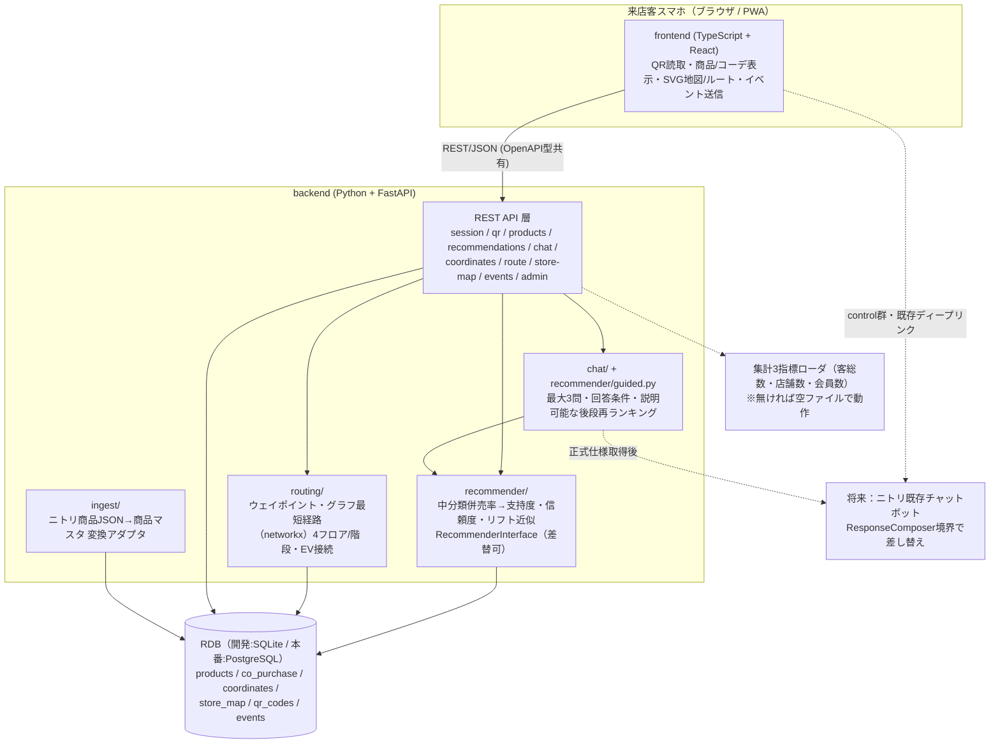

# Room Harmony 全体設計書（15章 step2）

前提：[DECISIONS.md](./DECISIONS.md)（14章 確定事項）に準拠。本書は合意用の全体設計。合意後に step3（リポジトリ雛形）へ進む。

---

## 1. アーキテクチャ概要



**設計原則**
- 責務分離：データ層／ロジック層（推薦・経路）／UI層。推薦ロジックと店舗データは差し替え可能（`RecommenderInterface`、データはアダプタ経由）。
- 型整合：OpenAPI スキーマ → フロントTS型を生成し不整合を防ぐ。
- 来店時のみ作動：有効な店内QR起点セッションが無ければ中核機能ロック（判定は差し替え可能、将来Wi-Fi/ジオフェンス拡張）。
- プライバシー：個人情報/購入情報をURLに載せない。ログはセッション単位で匿名。ガイド型チャットの自由入力本文は保存しない。

---

## 2. 確定版データモデル（論理設計）

> 6章をベースに、確定事項（中分類併売率／4フロア／qr_id／会員は集計3指標のみ）を反映。

### products（商品マスタ）
| 列 | 型 | 説明 |
|---|---|---|
| product_id | PK | 商品ID |
| name | text | 名称 |
| cat_large / cat_mid / cat_small | text | 大/中/小分類 |
| color | text | 色 |
| price | int | 価格 |
| image_url | text | 画像URL |
| floor | int | フロア（1〜4） |
| zone | text | ゾーン |
| x / y | float | 売場座標 |
| sub_passage_flag | bool | サブ通路商品か |

### co_purchase（併売/リフトテーブル）※**中分類レベル**
| 列 | 型 | 説明 |
|---|---|---|
| cat_mid_a / cat_mid_b | text | 中分類ペア |
| co_purchase_rate | float | 併売率（基本値） |
| support | float | 支持度（近似） |
| confidence | float | 信頼度（近似） |
| lift | float | リフト（近似） |
| high_lift_low_corate | bool | 「リフト高×併売率低」＝伸びしろフラグ |

商品→中分類でマップし、中分類ペアのリフトで関連商品を並べる。生データが将来入れば商品ペア版へ差し替え。

### coordinates（コーディネートマスタ）
| 列 | 型 | 説明 |
|---|---|---|
| coordinate_id | PK | コーデID |
| name | text | 名称 |
| theme | text | テーマ（ナチュラル/モダン等） |
| product_ids | json[] | 構成商品 |
| image_url | text | 完成イメージ |
| total_price_estimate | int | 合計金額目安 |

### store_map（店舗マップ）※4フロア
| 列 | 型 | 説明 |
|---|---|---|
| floor | int | フロア（1〜4） |
| floorplan_svg | text | フロアプランSVG/画像 |
| zones | json | ゾーン定義 |
| waypoints | json | グラフのノード（座標）。階段/EVノードを含む |
| edges | json | 通路接続・距離（階段/EVで階層接続） |
| sub_passages | json | サブ通路情報 |

### qr_codes（QRマスタ）
| 列 | 型 | 説明 |
|---|---|---|
| qr_id | PK | QR識別子 |
| type | enum | entrance / product |
| product_id | FK? | 商品QRの場合 |
| floor / x / y | 数値 | 設置座標 |
| direct_url | text | カメラ不可時のURL直リンク |

### events（セッション/イベントログ）
| 列 | 型 | 説明 |
|---|---|---|
| id | PK | 連番 |
| session_id | text | 匿名セッション |
| timestamp | datetime | 時刻 |
| event_type | text | session_start / qr_scan / related_view / related_tap / coordinate_view / coordinate_tap / route_view / chatbot_open / chatbot_answer / chatbot_recommendation_view / chatbot_recommendation_tap / chatbot_finish / experiment_group |
| payload | json | 各イベント詳細 |
| experiment_group | text | A/B割付（利用群/非利用群） |

### aggregates（集計3指標・オプショナル）
`customer_total, store_count, member_count`。参照可能なら投入、無ければ空ファイルで動作（欠損時も全機能可）。

---

## 3. API一覧（17章）

REST / JSON。OpenAPI スキーマを出力しフロントTS型を生成。

| メソッド/パス | 用途 | リクエスト | レスポンス |
|---|---|---|---|
| `POST /api/session` | 来店セッション開始（QR起点記録） | `qr_id` | `session_id, 起点座標, floor, experiment_group` |
| `GET /api/qr/{qr_id}` | QR解決（入口/商品判別） | — | `type, product_id?, 設置座標, direct_url` |
| `GET /api/products/{product_id}` | 商品詳細 | — | 商品情報（分類・色・価格・画像・売場） |
| `GET /api/recommendations` | 関連商品＋コーデ | `product_id`（＋`session_id`） | `related[]（リフト順）, coordinates[]` |
| `POST /api/chat/turn` | 商品文脈付きガイド型チャット | `product_id, action, mode, state`（＋`session_id`） | `message, question, state, recommendations, route_product_ids` |
| `GET /api/coordinates/{coordinate_id}` | コーデ詳細 | — | 構成商品・完成画像・合計金額目安 |
| `GET /api/route` | 簡易ルート | `from_qr, to_product`（複数可） | ウェイポイント座標列・経由サブ通路・巡回順 |
| `GET /api/store-map/{floor}` | フロアマップ | — | フロアプラン・ゾーン・ウェイポイント |
| `POST /api/events` | 効果ログ記録 | `session_id, event_type, payload` | 記録結果 |

- 認証：来店客向けは無認証だが `session_id` で不正直アクセス制限。管理系（投入/ダッシュボード）は認証必須。
- バリデーション：不正 `qr_id`・存在しない `product_id` は明確なエラーコード。
- **来店ロック**：有効な起点セッションが無い状態での recommendations/route 等は 4xx＋QR読取誘導。

---

## 4. 画面一覧（7章）

| # | 画面 | 主内容 | 主なAPI | 発火ログ |
|---|---|---|---|---|
| S1 | 起動/スキャン | QR読取。読取地点を起点として記録。カメラ不可時はURL直リンク | `POST /session`, `GET /qr/{id}` | session_start, qr_scan |
| S2 | 商品詳細 | 商品情報＋関連商品＋コーデ＋最大3問のガイド型チャット | `GET /products/{id}`, `GET /recommendations`, `POST /chat/turn` | related_view, related_tap, chatbot_* |
| S3 | コーデ詳細 | 完成イメージ大・構成商品・合計金額・「揃える/場所を見る」 | `GET /coordinates/{id}` | coordinate_view, coordinate_tap |
| S4 | マップ・ルート | 起点→目的商品の簡易ルート、経由サブ通路、複数目的地の巡回順、フロア切替 | `GET /route`, `GET /store-map/{floor}` | route_view |
| S5 | ガイド型チャット／外部Bot導線 | treatment群は商品ページ内で質問・再推薦。control群は既存外部リンクを維持 | `POST /chat/turn`／外部 | chatbot_open, chatbot_answer, chatbot_recommendation_tap, chatbot_finish |

**UXフロー（ハッピーパス）**
```
S1 商品QR → S2 商品詳細（関連＋コーデ） → S5 ガイド型チャット（最大3問・途中終了可）
   → S4 複数商品のルート表示（起点→候補・サブ通路経由） → 商品比較・回遊
```
UX方針：入力極小化（QRを読むだけ）、コーデ完成イメージを大きく、常設のワンタップ「場所を見に行く」。

---

## 5. リポジトリ構成（16章、step3で作成予定）

```
room-harmony/
├─ frontend/   # TS + React（PWA, QR読取, SVG地図, UI）
├─ backend/    # Python + FastAPI
│   ├─ app/            # API層
│   │   └─ chat/       # 質問ポリシー・会話サービス・応答生成境界
│   ├─ recommender/    # 中分類併売率→リフト近似, RecommenderInterface
│   │   └─ guided.py   # 回答条件による後段再ランキング・説明根拠
│   ├─ routing/        # ウェイポイントグラフ最短経路
│   └─ ingest/         # ニトリ商品JSON変換アダプタ
├─ data/       # サンプル（商品・併売/リフト・コーデ・マップ・QR・集計3指標）
├─ docs/       # 本設計書・ハーネス・確定ログ・API仕様
├─ harness/    # ゲート証跡・レポート（構築済み）
├─ tests/      # 単体・結合・E2E
├─ .env.example
└─ README.md
```

---

## 6. 段階実装計画（13章 フェーズ1 = MVP）とゲート対応

| 実装単位 | 内容 | ゲート（HARNESS.md） |
|---|---|---|
| B1 推薦ロジック | 中分類併売率→リフト近似、ハイブリッド並び順 | G1 単体 |
| B2 経路計算 | 4フロア・ウェイポイント最短経路・巡回順 | G1 単体 |
| B3 API | REST API＋バリデーション＋来店ロック＋構造化Chat API | G2 結合 |
| B4 データ | 商品9,180・中分類併売(仮値)・暫定コーデ6・4フロア検証マップ・QR | G2で利用 |
| B5 フロント | S1〜S5、QR読取(URL直リンク含む)、SVG地図・ルート | G3 結合 |
| B6 計測 | 各操作にイベントログ＋experiment_group | G2/G4 |
| B7 E2E | QR起点→関連→コーデ→ルート→ログ 一気通貫 | G4 E2E |
| B8 ガイド型チャット | 適応質問→後段再ランキング→商品カード→複数商品ルート→匿名KPI | G1/G2/G3 |
```
